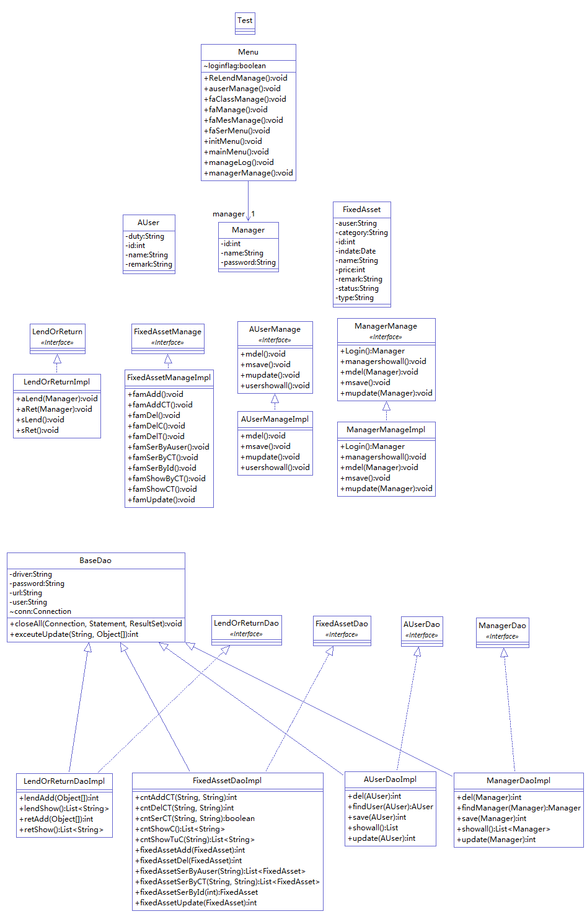

# Fixed Assets MS

This is a project aimed at building a system to manage the assets of a warehouse.
It would handle a usecase when you are managing a warehouse of a company in which you need to record the people who take the assets away and back, monitor remaining of assets etc. 

# Dependencies

This project used MicroSoftSqlServer for database, JDBC to connect application with the database and JAVA as the language to develop.

# Key functions:

This project provides functions as list below:

* Administrator opreation.
    * Change password
    * Add new administrator
    * Delete administrator
    * Print all administrators
* User record.
    *  Add new user information
    *  Change information of exist user
    *  Delete exist user
    *  Print all users
* Assets category management.
    * Add new assets information with category and sub-category
    * Delete category
    * Delete sub-categoty
    * Print all categories and their sub-categories
* Company assets management 
    * Add new assets information
        * name
        * category
        * value
        * date
        * status
            * normal
            * under repair
            * scrapped
        * notes
    * Edit information of exist assets
        * name
        * category
        * value
        * date
        * status
            * normal
            * under repair
            * scrapped
        * notes 
    * Delete assets
    * Query assets information
        * Query by ID
        * Query by category
        * Query by user
    * Show all assets ordered by categories
* Lend and return
    * Lend assets
    * Print all lending records
    * Return assets
    * Print all return records

# UML

